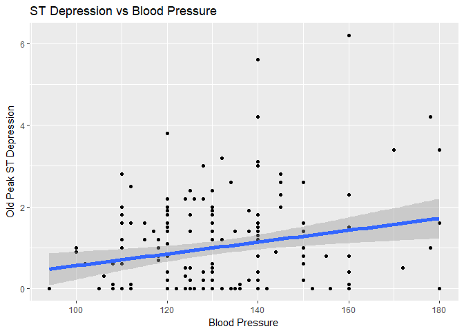

Correlation Analysis
================

The previous section focused on the relationship between each feature and the outcome. In this section the relationship between pairs of features, and sometimes pairs vs the outcome, is analyzed. Since most features are categorical or represented by integers that can take very few values (e.g. from 1 to 4), the correlation matrix is not relevant for most pairs and a lot of relationships are analyzed graphically.

### Correlation matrix

The correlation matrix is calculated for numeric features. To allow it to display decently, some features are renamed. The correlation is obviously high between ST segment and ST depression and relevant between ST segment and heart rate.

``` r
round(cor(training[,c(2,4:6,8:10,12:13)]),2)
```

    ##            ST_Segm Pressure  Pain Vessels   EKG Cholest ST_Depr   Age
    ## ST_Segm       1.00     0.10  0.12    0.08  0.17   -0.03    0.62  0.17
    ## Pressure      0.10     1.00 -0.03    0.04  0.08    0.14    0.22  0.28
    ## Pain          0.12    -0.03  1.00    0.25  0.03    0.06    0.08  0.09
    ## Vessels       0.08     0.04  0.25    1.00  0.10    0.10    0.21  0.35
    ## EKG           0.17     0.08  0.03    0.10  1.00    0.17    0.10  0.13
    ## Cholest      -0.03     0.14  0.06    0.10  0.17    1.00   -0.02  0.24
    ## ST_Depr       0.62     0.22  0.08    0.21  0.10   -0.02    1.00  0.19
    ## Age           0.17     0.28  0.09    0.35  0.13    0.24    0.19  1.00
    ## Heart_Rate   -0.42    -0.02 -0.30   -0.28 -0.10   -0.07   -0.34 -0.39
    ##            Heart_Rate
    ## ST_Segm         -0.42
    ## Pressure        -0.02
    ## Pain            -0.30
    ## Vessels         -0.28
    ## EKG             -0.10
    ## Cholest         -0.07
    ## ST_Depr         -0.34
    ## Age             -0.39
    ## Heart_Rate       1.00

### ST Segment and ST Depression vs Heart Disease

ST Segment and ST Depression are correlated and when their values are high heart disease frequency tends to increase.

``` r
ggSTH <- ggplot(training, aes(x = ST_Segm, 
    y = ST_Depr)) + geom_point(aes(color = heart_disease_present))
ggSTH <- ggSTH + labs(x = "Slope of ST Segment", y = "ST Depression", 
                      title = "ST Segment, Depression and Heart Disease")
ggSTH <- ggSTH + scale_colour_discrete(name = "Heart Disease", 
                                       labels = c("No Disease","Disease"))
ggSTH
```


### ST Segment and Thallium stress test

From the plot below, as the ST Segment slope increases, the thallium test is more likely to show defects.

``` r
ggSTha <- ggplot(training, aes(x = ST_Segm, fill = thal)) + 
  geom_bar(position = "fill")
ggSTha <- ggSTha + labs(title = "ST Segment vs Thallium stress test", 
                    x = "Slope of the peak exercise ST segment", y = "Fraction")
ggSTha <- ggSTha + scale_fill_discrete(name = "Thallium stress test",
                    labels = c("Fixed Defect","Normal", "Reversible Defect"))
ggSTha 
```


### Blood Pressure and thallium stress test

The Blood Pressure is higher only for fixed defect, which is present in only few cases, but there is almost no difference in pressure when the thallium test has other results.

``` r
ggBPT <- ggplot(training, aes(x = thal, y = as.numeric(Pressure))) + 
  geom_boxplot()
ggBPT <- ggBPT + labs(x = "Thallium stress test", y = "Resting Blood Pressure",
                      title = "Thallium test vs Blood Pressure")
ggBPT
```


### Chest pain and thallium stress test

Patients with high chest pain have typically more defects from the thallium test. The plot is strikingly similar to the one between heart disease and chest pain. This leads me to believe that the result of the thallium test is the real driver of the condition and chest pain is simply one way in which the disease manifests itself.

``` r
ggCPT <- ggplot(training, aes(x = Pain, fill = thal)) + 
  geom_bar(position = "fill")
ggCPT <- ggCPT + labs(title = "Chest pain vs Thallium stress test", 
                    x = "Chest pain", y = "Fraction")
ggCPT <- ggCPT + scale_fill_discrete(name = "Thallium stress test",
                                   labels = c("Fixed Defect","Normal", "Reversible Defect"))
ggCPT
```


### Number of major vessels and thallium stress test

The probability of defects from the thallium test increases with the number of major vessels.

``` r
ggmvT <- ggplot(training, aes(x = Vessels, fill = thal)) + 
  geom_bar(position = "fill")
ggmvT <- ggmvT + labs(title = "Major vessels vs Thallium stress test", 
                      x = "Number of major vessels", y = "Fraction")
ggmvT <- ggmvT + scale_fill_discrete(name = "Thallium stress test",
                                     labels = c("Fixed Defect","Normal", "Reversible Defect"))
ggmvT 
```


### Serum Cholesterol and thallium stress test

Considering that very few patients have fixed defects, cholesterol values don't seem to be affected by thallium test.

``` r
ggscT <- ggplot(training, aes(x = thal, y = as.numeric(Cholest))) + 
  geom_boxplot()
ggscT <- ggscT + labs(x = "Thallium stress test", y = "Serum Cholesterol",
                      title = "Cholesterol vs Thallium test")
ggscT
```


### Blood Pressure and Cholesterol

The plot shows some positive correlation, which makes sense since cholesterol tends to clog blood vessels and increase blood pressure. The results however are pretty scattered as probably more elements affect the pressure.

``` r
ggscBP <- ggplot(training, aes(x = as.numeric(Pressure), y = as.numeric(Cholest))) + 
  geom_point()
ggscBP <- ggscBP + geom_smooth(size = 2, linetype = 1, method = "lm", se = T)
ggscBP <- ggscBP + labs(x = "Blood Pressure", y = "Serum Cholesterol",
                        title = "Cholesterol vs Blood Pressure")
ggscBP
```


### Major Vessels and Cholesterol

Cholesterol goes up a little when the vessels increase above 0 but overall the relationship is almosst insignificant.

``` r
ggscmv <- ggplot(training, aes(x = as.factor(Vessels), y = as.numeric(Cholest))) + 
  geom_boxplot()
ggscmv <- ggscmv + labs(x = "Major Vessels", y = "Serum Cholesterol",
                        title = "Cholesterol vs Major Vessels")
ggscmv
```


### Old Peak ST Depression and Thallium Test

The Old Peak ST Depression is significantly higher when there are defects in the Thallium test.

``` r
ggSTT <- ggplot(training, aes(x = thal, y = ST_Depr)) + 
  geom_boxplot()
ggSTT <- ggSTT + labs(x = "Thallium Test", y = "Old Peak ST Depression",
                      title = "ST Depression vs Thallium Test")
ggSTT
```


### Pressure and Old Peak ST Depression

Although scattered, the plot shows a definite increase in ST depression with blood pressure.

``` r
ggSTBP <- ggplot(training, aes(x = as.numeric(Pressure), y = ST_Depr)) + 
  geom_point()
ggSTBP <- ggSTBP + geom_smooth(size = 2, linetype = 1, method = "lm", se = T)
ggSTBP <- ggSTBP + labs(x = "Blood Pressure", y = "Old Peak ST Depression",
                        title = "ST Depression vs Blood Pressure")
ggSTBP
```



### Sex and Thallium Test

The last plots are focused on the relationship between sex and other features since males showed a significantly higher disease rate, which should be explained by the other features. In this case the males in the study have a much higher probability of having defects from the thallium test.

``` r
ggsxm <- ggplot(training, aes(x = thal, fill = sex)) + 
  geom_bar(position = "fill")
ggsxm <- ggsxm + labs(title = "Thallium Test vs Sex", 
                      x = "Thallium Test", y = "Fraction")
ggsxm <- ggsxm + scale_fill_discrete(name = "Sex")
ggsxm
```


### Sex and Chest Pain

Males show a much higher probability of having chest pain.

``` r
ggsxa <- ggplot(training, aes(fill = exercise_induced_angina, x = sex)) + 
  geom_bar(position = "fill")
ggsxa <- ggsxa + labs(title = "Exercise-induced Chest Pain vs Sex", 
                      x = "Sex", y = "Fraction")
ggsxa <- ggsxa + scale_fill_discrete(name = "Exercise-induced Chest Pain")
ggsxa
```


