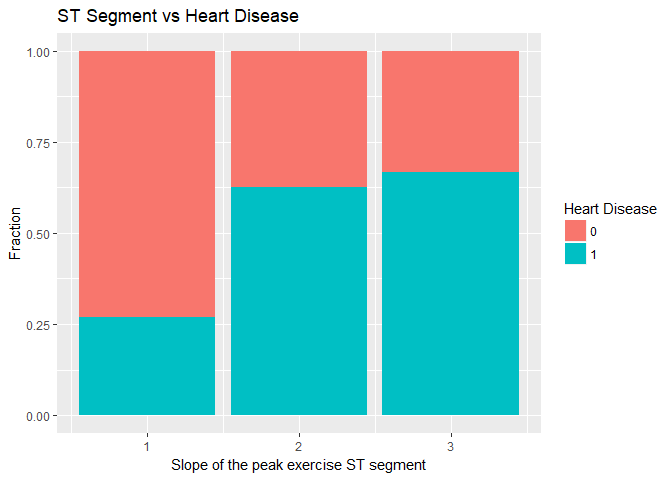
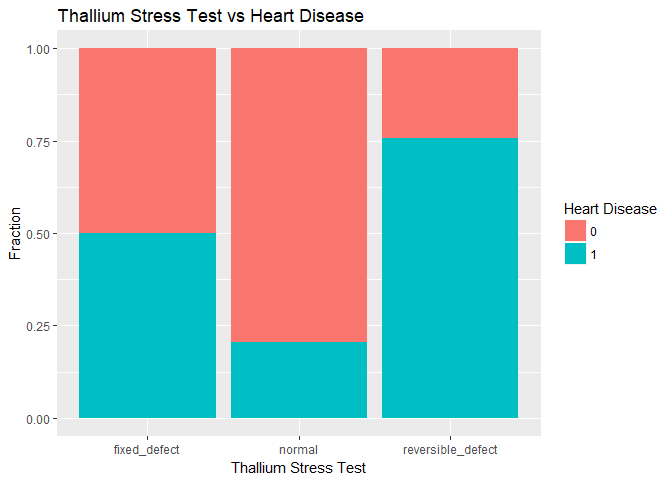
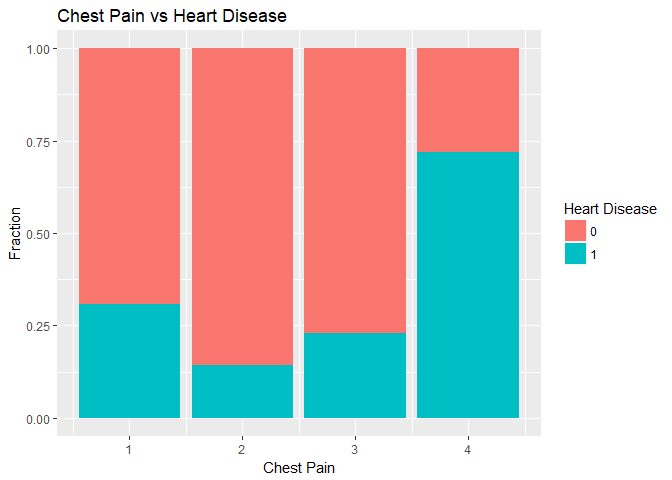
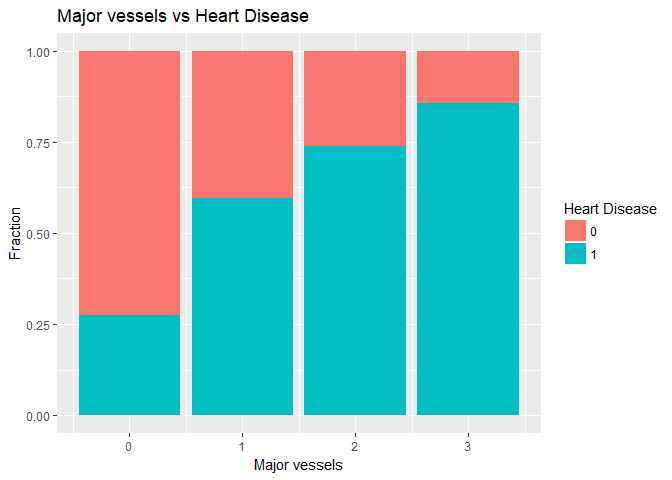
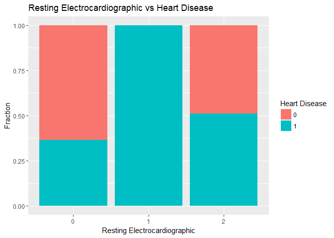
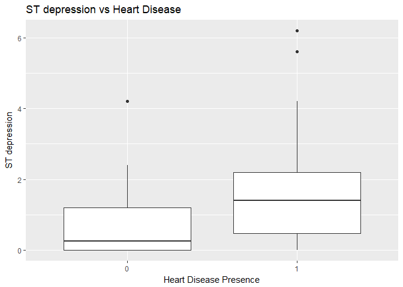
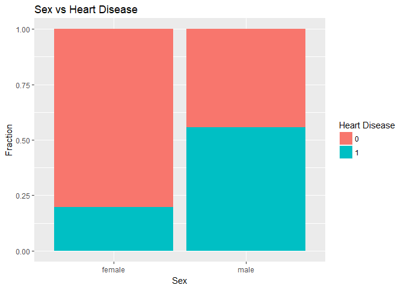
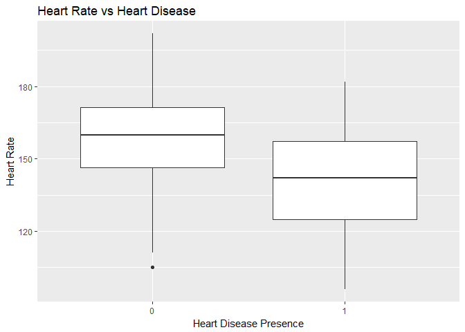
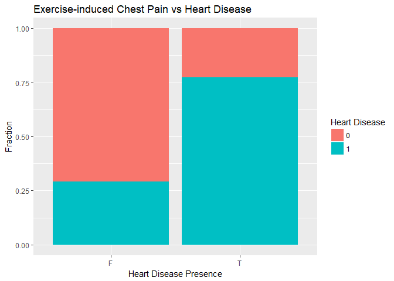

Exploratory Analysis
================

``` r
knitr::opts_chunk$set(cache=TRUE, echo=TRUE, warning = FALSE, message = FALSE)
```

In this section I will analyze the features and their relationship with the outcome.

The first step is to load the files and, for the training set, combine the features and the labels in one dataset. Some features need to be converted to factors and for the sake of clarity I rename some of the classes since 0 and 1 can be confusing (also it's not nice to identify females with zeros!)

``` r
knitr::opts_chunk$set(echo = TRUE)

# Load required packages
library(dplyr)
library(tidyr)
library(plyr)
library(ggplot2)

# Load data
training <- read.csv("train_values.csv")
train_labels <- read.csv("train_labels.csv")
test_values <- read.csv("test_values.csv")

# Combine training files in one dataset
training <- left_join(training, train_labels, by = "patient_id")

# Transform features as factors and rename labels for some of them
training$fasting_blood_sugar_gt_120_mg_per_dl <- as.factor(training$fasting_blood_sugar_gt_120_mg_per_dl)
training$sex <- as.factor(training$sex)
training$sex <- revalue(training$sex, c("0" = "female", "1" = "male"))
training$exercise_induced_angina <- as.factor(training$exercise_induced_angina)
training$exercise_induced_angina <- revalue(training$exercise_induced_angina, c("0" = "F", "1" = "T"))
# For label, 0 means no heart disease
training$heart_disease_present <- as.factor(training$heart_disease_present)

test_values$fasting_blood_sugar_gt_120_mg_per_dl <- as.factor(test_values$fasting_blood_sugar_gt_120_mg_per_dl)
test_values$sex <- as.factor(test_values$sex)
test_values$sex <- revalue(test_values$sex, c("0" = "female", "1" = "male"))
test_values$exercise_induced_angina <- as.factor(test_values$exercise_induced_angina)
test_values$exercise_induced_angina <- revalue(test_values$exercise_induced_angina, c("0" = "F", "1" = "T"))
```

The first thing to check is if the classes are imbalanced but it's not the case: 44% of patients have heart disease.

``` r
table(training$heart_disease_present)
```

    ## 
    ##   0   1 
    ## 100  80

### Slope of Peak Exercise ST Segment

For this feature only few records have the maximum value so looking at them might not be relevant. However the presence of heart disease increases rapidly with an increase from 1 to 2 of the this feature so it seems to have an effect.

``` r
# Analyze class balance
table(training$slope_of_peak_exercise_st_segment)
```

    ## 
    ##  1  2  3 
    ## 93 75 12

``` r
# Plot relationship with heart disease
ggST <- ggplot(training, aes(x = slope_of_peak_exercise_st_segment, fill = heart_disease_present)) + 
          geom_bar(position = "fill")
ggST <- ggST + labs(title = "ST Segment vs Heart Disease", 
                      x = "Slope of the peak exercise ST segment", y = "Fraction")
ggST <- ggST + scale_fill_discrete(name = "Heart Disease")
ggST 
```



### Thallium Stress Test

Very few records have a fixed defect so it might be difficult to evaluate the impact of a test with this result. There is however a great difference in heart disease presence between normal results and reversible defects. This feature seems to be very relevant.

``` r
# Analyze class balance
table(training$thal)
```

    ## 
    ##      fixed_defect            normal reversible_defect 
    ##                 8                98                74

``` r
# Plot relationship with heart disease
ggTh <- ggplot(training, aes(x = thal, fill = heart_disease_present)) + 
  geom_bar(position = "fill")
ggTh <- ggTh + labs(title = "Thallium Stress Test vs Heart Disease", 
                    x = "Thallium Stress Test", y = "Fraction")
ggTh <- ggTh + scale_fill_discrete(name = "Heart Disease")
ggTh
```



### Chest Pain

The frequency increases with the value of chest pain, only few records have a value of 1 while almost half have the maximum value. For max values of chest pain, heart disease has a very high frequency. There doesn't seem to be much difference between the other 3 levels. This is probably a subjective test and it could explain this highly non linear relationship. It's easy to imagine patients being incapable of really distinguish between level 2 or 3 for a pain that is not particularly troubling and many assign a 4 when they are really bothered.

``` r
# Analyze class balance
table(training$chest_pain_type)
```

    ## 
    ##  1  2  3  4 
    ## 13 28 57 82

``` r
# Plot relationship with heart disease
ggch <- ggplot(training, aes(x = chest_pain_type, fill = heart_disease_present)) + 
  geom_bar(position = "fill")
ggch <- ggch + labs(title = "Chest Pain vs Heart Disease", 
                    x = "Chest Pain", y = "Fraction")
ggch <- ggch + scale_fill_discrete(name = "Heart Disease")
ggch
```



### Number of major vessels

The classes are imbalanced, the majority of patients show no vessel and it decreases as the number of vessels go up. On the other side the presence of heart disease grows quickly with the number of vessels so a relationship seems evident.

``` r
# Analyze class balance
table(training$num_major_vessels)
```

    ## 
    ##   0   1   2   3 
    ## 106  37  23  14

``` r
# Plot relationship with heart disease
ggmv2 <- ggplot(training, aes(x = num_major_vessels, fill = heart_disease_present)) 
ggmv2 <- ggmv2 + geom_bar(position = "fill") + 
  labs(title = "Major vessels vs Heart Disease", x = "Major vessels", y = "Fraction")
ggmv2 <- ggmv2 + scale_fill_discrete(name = "Heart Disease")
ggmv2
```



### Resting electrocardiographic results

Only 1 record has a value of 1, which makes me think it might be an error. It's basically a binary variable. Ignoring this class, there is a slight increase in heart disease with EKG but much smaller than for other features.

``` r
# Analyze class balance
table(training$resting_ekg_results)
```

    ## 
    ##  0  1  2 
    ## 85  1 94

``` r
# Plot relationship with heart disease
ggekg <- ggplot(training, aes(x = as.factor(resting_ekg_results), fill = heart_disease_present)) 
ggekg <- ggekg + geom_bar(position = "fill") + 
  labs(title = "Resting Electrocardiographic vs Heart Disease", 
       x = "Resting Electrocardiographic", y = "Fraction")
ggekg <- ggekg + scale_fill_discrete(name = "Heart Disease")
ggekg
```



### ST depression

The boxplot shows a higher median for ST depression among people with a heart disease although the 2 boxes have a significant overlap.

``` r
# Plot relationship with heart disease
ggSD <- ggplot(training, aes(x = heart_disease_present, 
                             y = oldpeak_eq_st_depression)) + geom_boxplot()
ggSD <- ggSD + labs(title = "ST depression vs Heart Disease", 
                    x = "Heart Disease Presence", y = "ST depression")
ggSD
```



### Sex

Among men heart disease is much more present, it's possible that male patients are significantly different than women for other factors like age.

``` r
# Plot relationship with heart disease
ggsx <- ggplot(training, aes(x = sex, fill = heart_disease_present))  
ggsx <- ggsx + geom_bar(position = "fill")
ggsx <- ggsx + labs(title = "Sex vs Heart Disease", x = "Sex", y = "Fraction") + 
  scale_fill_discrete(name = "Heart Disease")
ggsx
```



### Heart Rate

The boxplot shows that the heart rate is actually lower for patients with heart disease which is definitely unusual.

``` r
# Plot relationship with heart disease
gghr <- ggplot(training, aes(x = heart_disease_present, 
                             y = max_heart_rate_achieved)) + geom_boxplot()
gghr <- gghr + labs(title = "Heart Rate vs Heart Disease", 
                    x = "Heart Disease Presence", y = "Heart Rate")
gghr
```



### Exercise-induced Chest Pain

There is a significant increase in heart disease presence for patients with chest pain. This feature seems to be very relevant.

``` r
# Plot relationship with heart disease
ggan <- ggplot(training, aes(x = exercise_induced_angina, fill = heart_disease_present))  
ggan <- ggan + geom_bar(position = "fill")
ggan <- ggan + labs(title = "Exercise-induced Chest Pain vs Heart Disease",
        x = "Heart Disease Presence", y = "Fraction") + scale_fill_discrete(name = "Heart Disease")
ggan
```



Other plots were done to explore the relationship that heart disease has with Resting Blood Pressure and Fasting Blood Sugar but no apprent effect was discovered so these plots are omitted.
