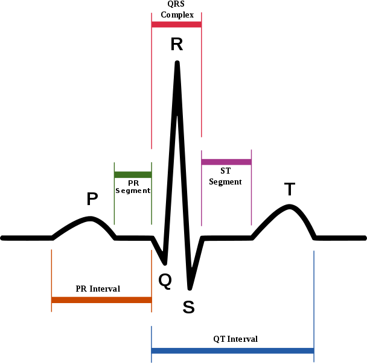

### Features

The study collects various measurements on patient health and cardiovascular statistics. The 13 features are:

* __slope_of_peak_exercise_st_segment__ (integer): the slope of the peak exercise ST segment, an electrocardiography read out indicating quality of blood flow to the heart
* __thal__ (categorical): results of thallium stress test measuring blood flow to the heart, with 3 possible values equal to normal, fixed_defect, reversible_defect
* __resting_blood_pressure__ (integer): resting blood pressure
* __chest_pain_type__ (integer): it takes 4 values from 1 to 4
* __num_major_vessels__ (integer): number of major vessels colored by fluoroscopy (from 0 to 3)
* __fasting_blood_sugar_gt_120_mg_per_dl__ (binary): 1 if fasting blood sugar > 120 mg/dl, 0 otherwise
* __resting_ekg_results__ (integer): resting electrocardiographic results (values 0, 1, 2)
* __serum_cholesterol_mg_per_dl__ (integer): serum cholesterol in mg/dl
* __oldpeak_eq_st_depression__ (decimal): oldpeak = ST depression induced by exercise relative to rest, a measure of abnormality in electrocardiograms
* __sex__ (binary): 0 for female, 1 for male
* __age__ (integer): age in years
* __max_heart_rate_achieved__ (integer): maximum heart rate achieved (beats per minute)
* __exercise_induced_angina__ (binary): exercise-induced chest pain (0: False, 1: True)

Additional description for some of the features is reported below.

##### __Slope of Peak Exercise ST Segment__

The ST segment is a part of the electrocardiogram and it's represented in the picture below.  
{width=350px}

From Wikipedia, the ST segment represents the isoelectric period when the ventricles are in between depolarization and repolarization. Essentially it's the period in which ventricles contract and pump blood.
It can be used to diagnose heart conditions, for example:

* a normal ST segment has a slight upward concavity
* Flat, downsloping, or depressed ST segments may indicate coronary ischemia
* ST elevation may indicate transmural myocardial infarction
* ST depression may be associated with subendocardial myocardial infarction, hypokalemia, or digitalis toxicity.

##### __Thallium Stress Test__

The thallium stress test is a nuclear imaging test that shows how well blood flows into the heart. The test includes an exercise and resting portion, and the heart is photographed during both. 
During the procedure, a liquid with a small amount of radioactivity is administered into a vein. The radioisotope will flow through the bloodstream to the heart, then a special camera will detect the radiation and reveal any issue. 
The thallium stress test can show:

* the size of the heart chambers
* how effectively the heart pumps
* how well coronary arteries supply the heart with blood
* if the heart muscle is damaged or scarred from previous heart attacks

##### __Number of Major Vessels__

Fluoroscopy is a study of moving body structures, it is often done while a contrast dye moves through the part of the body being examined. A continuous X-ray beam is passed through the body part and sent to a video monitor so that the body part and its motion can be seen in detail. 
In this case it is applied to the heart to see the flow of blood through the coronary arteries and check for blockages. The higher the number of vessels colored, the worse the heart condition.

##### __Resting EKG Results__

This type of electrocardiogram is the standard test for measuring heart’s electrical function. Performed while lying still, this EKG records heart’s electrical activity from electrodes placed on the chest, arms, and legs at the same time. It is usually a routine checkup to screen for heart conditions before any signs or symptoms develop. 

##### __Oldpeak = ST Depression__

ST depression refers to a finding on an electrocardiogram wherein the trace in the ST segment is abnormally low below the baseline. It is often a sign of myocardial ischemia, of which coronary insufficiency is a major cause. Other ischemic heart diseases causing ST depression include:

* Subendocardial ischemia or even infarction
* Non Q-wave myocardial infarction
* acute Q-wave myocardial infarction 
* unstable angina

ST segment depression may be determined by measuring the vertical distance between the patient's trace and the isoelectric line at a location 2-3 millimeters from the QRS complex.

##### __Exercise Induced Angina__

Angina is a type of chest pain caused by reduced blood flow to the heart and it is a symptom of coronary artery disease. It is often described as squeezing, pressure, heaviness, tightness or pain in your chest. Angina may be a new pain that needs evaluation by a doctor, or recurring pain that goes away with treatment.

Exercise induced angina is called stable and it usually has these characteristics:

* develops when the heart works harder
* can be predicted and the pain is usually similar to previous types of chest pain
* lasts five minutes or less
* disappears sooner with rest or medication

It's different from an unstable one, which is a medical emergency and might be a sign of a heart attack.