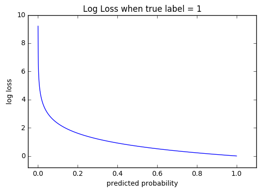

### Performance Metric

The performance of the model is measured by log loss. In general I favor models that express the result with a probability rather than a binary value since it allows a human to take a second look for cases about which the model is not very confident.  
The formula is:

where:

y is the label (1 for heart disease presence)
p(y) is the probability predicted by the model
N is the number of records

Mathematically this formula penalizes large errors (probabilities far from the true label), which makes sense for an healthcare related problem where big mistakes can have catastrophic consequences. 
This plot shows the log loss as a function of the predicted probability for a case in which the true value is 1. You can see how large it becomes as the prediction falls under 0.5.

For error rate between 0 and 1, the Log Loss is equal to Cross-Entropy, which is another term often used in Machine Learning.

Because the goal of the competition is minimizing the log loss, simplifying the model by reducing the number of features will not be pursued in this project.

The benchmark used by the host of the competition is Logistic Regression with a log loss = 0.5381. 
In a binary case like this, when one class represents 44% of the cases (from the training data), the "dumb" guess corresponding to predicting 0.5 for every record, has a log loss of about 0.68.